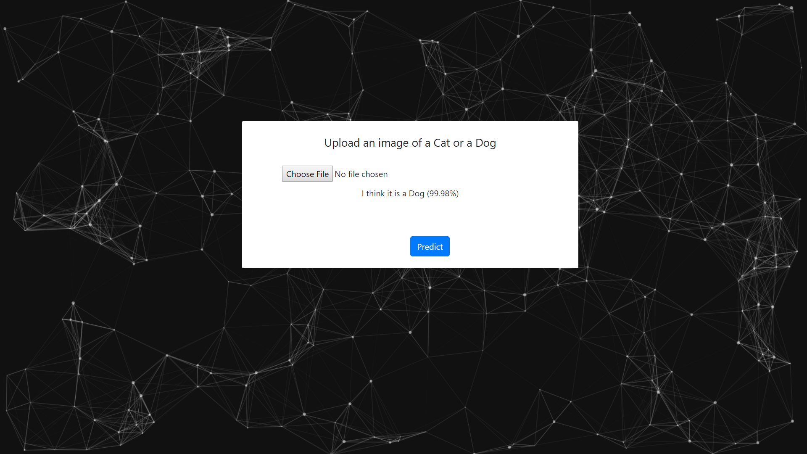

# Cambrian

Classifying cats from dogs using machine learning

### Steps

1. Use pixabay.py to download images of cats and dogs and save them into train dataset
2. Move about 20% of the images from train dataset into the valid dataset
3. Use remove_duplicates.py to remove images that might be repeating in the train and valid datasets
4. Run the train.py script
5. Used the trained model in the main.py script
6. Navigate to http://127.0.0.1:5000
